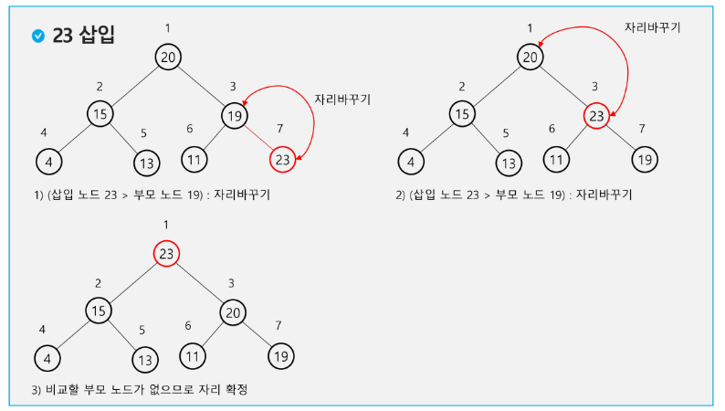
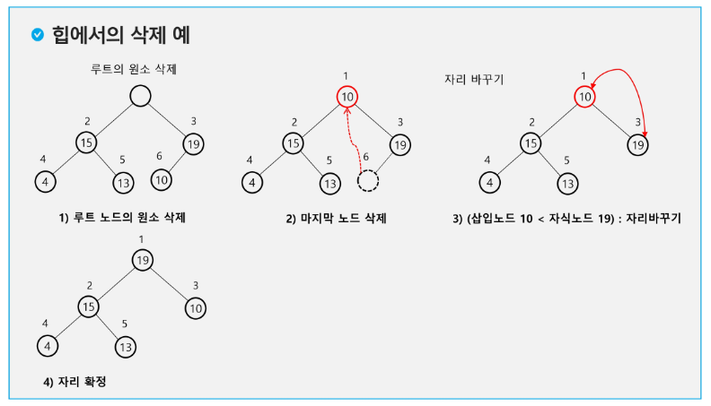

# 8/21 강의
## 트리
- 비선형 구조
- 원소들 간에 1:n 관계를 가지는 자료구조
- 원소들 간에 계층관계를 가지는 계층형 자료구조
- 상위 원소에서 하위 원소로 내려가면서 확장되는 트리 모양
### 정의
- 한 개 이상의 노드로 이루어진 유한 집합
    - 최상위 노드를 root라 한다
    - 나머지 노드들은 n개의 분리 집합(T1, ..., TN)으로 분리될 수 있다
- T1, ..., TN은 각각 하나의 트리가 되며(재귀) 루트의 부 트리(subtree)라고 한다
### 용어
- 노드(node): 트리의 원소
- 간선(edge): 노드를 연결하는 선
- 루트 노드: 트리의 시작 노드
- 형제 노드(sibling node): 같은 부모 노드의 자식 노드들
- 조상 노드: 간선을 따라 루트 노드까지 이르는 경로에 있는 노드들
- subtree: 부모 노드와 연결된 간선을 끊었을 때 생성되는 트리
- 자손 노드: 서브 트리에 있는 하위 레벨의 노드들
- 차수(degree)
    - 노드의 차수: 노드에 연결된 자식 노드 수
    - 트리의 차수: 트리에 있는 노드의 차수 중에서 가장 큰 값 (자식 노드의 수 중 가장 큰 값)
    - 리프 노드(잎 노드): 차수가 0인 노드, 자식 노드가 없는 노드
- 높이
    - 노드의 높이: 루트에서 노드에 이르는 간선의 수, 노드 레벨
    - 트리의 높이: 노드의 높이 중에서 가장 큰 값, 최대 레벨
## 이진트리
- 모든 노드들이 2개의 서브트리를 갖는 특별한 형태의 트리
- 각 노드가 자식 노드를 최대 2개까지만 가질 수 있는 트리
    - 왼쪽, 오른쪽 자식 노드
### 특성
- 레벨 i에서 노드의 최대 개수는 2**i
- 높이가 h인 이진 트리
    - 노드의 최소 개수: h+1
    - 노드의 최대 개수: 2**(h+1)-1
### 종류
#### 포화 이진 트리(Full Binary Tree)
- 모든 레벨에 노드가 포화상태로 차 있는 이진 트리
- 높이가 h일 때 `루트를 1번`으로 하여 2**(h+1)-1까지 정해진 위치에 대한 노드를 가짐
### 완전 이진 트리(Complete Binary Tree)
- 노드 수가 n개일 때, 1번부터 n번까지 빈 자리가 없는 이진 트리
- 포화 이진 트리 처럼 노드 번호를 붙였을 때 빈 번호가 없음
### 편향 이진 트리(Skewed Binary Tree)
- 높이 h에 대한 최소 개수의 노드를 가지면서 한 쪽 방향의 자식 노드만 가진 이진 트리
### 순회(traversal)
> 각 노드를 중복되지 않게 전부 방문하는 것<br/>
>  트리는 비 선형 구조이기 때문에 선형구조에서와 같이 선후 연결 관계를 알 수 없다 -> 특별한 방법 필요
- 트리의 노드들을 체계적으로 방문하는 것
#### 기본적인 순회 방법
> 왼쪽부터 순회한다
- 전위순회(preorder traversal): VLR
    - 부모 노드 방문 -> 자식노드를 좌, 우 순서로 방문
- 중위순회(inorder traversal): LVR
    - 왼쪽 자식노드 -> 부모노드 -> 오른쪽 자식노드 순으로 방문
- 후위순회(postorder traversal): LRV
    - 자식노드를 좌, 우 순서로 방문 -> 부모노드 방문
#### 전위순회
1. 현재 노드 n을 방문하여 처리한다 -> V
2. 현재 노드 n의 왼쪽 서브트리로 이동한다 -> L
3. 현재 노드 n의 오른쪽 서브트리로 이동한다 -> R
```python
def preorder_traverse(T):
    if T:
        visit(T)    # do 
        preorder_traverse(T.left)
        preorder_traverse(T.right)
```
```
        A           총 순서
      /   \         A B D E H I C F G
     B     C
   /  \   /  \
  D    E F    G
      / \
     H   I
```
#### 중위순회
1. 현재 노드 n의 왼쪽 서브트리로 이동한다 -> L
2. 현재 노드 n을 방문하여 처리한다 -> V
3. 현재 노드 n의 오른쪽 서브트리로 이동한다 -> R
```python
def inorder_traverse(T):
    if T:
        inorder_traverse(T.left)
        visit(T)    # do 
        inorder_traverse(T.right)
```
```
        A           총 순서
      /   \         D B H E I A F C G
     B     C
   /  \   /  \
  D    E F    G
      / \
     H   I
```
#### 후위 순회
1. 현재 노드 n의 왼쪽 서브트리로 이동한다 -> L
2. 현재 노드 n의 오른쪽 서브트리로 이동한다 -> R
3. 현재 노드 n을 방문하여 처리한다 -> V
```python
def postorder_traverse(T):
    if T:
        inorder_traverse(T.left)
        inorder_traverse(T.right)
        visit(T)    # do 
```
```
        A           총 순서
      /   \         D H I E B F G C A
     B     C
   /  \   /  \
  D    E F    G
      / \
     H   I
```
#### 순회 연습
```
           A                2레벨 / 3레벨 까지 순회 
       /       \            전위순회
      B          C          A B D E C F G / A B D H I E J C F K G L M
   /     \    /     \       중위순회
  D       E  F       G      D B E A F C G / H D I B J E A F K C L G M
 / \     /    \     / \     후위순회
H   I   J      K   L   M    D E B F G C A / H I D J E B K F L M G C A
```
### 이진트리의 표현 - 배열
- 노드 번호의 성질
    - 노드 번호가 i인 노드의 `왼쪽 자식` 노드 번호: 2*i
    - 노드 번호가 i인 노드의 `오른쪽 자식` 노드 번호: 2*i+1
    - 노드 번호가 i인 노드의 `부모` 노드 번호: i // 2
    - 레벨 n의 노드 시작 번호: 2**n
- 배열을 이용한 이진 트리의 표현
    - 노드 번호를 인덱스로 사용
    - 부모 번호를 인덱스로 자식 번호를 저장
        ```python
        child1 = [0] * (N+1)
        child2 = [0] * (N+1)
        for i in range(1, N+1):
            read parent, child
            if child1[parent] == 0:
                child1[parent] = c
            else:
                child2[parent] = c
        ```
    - 자식 번호를 인덱스로 부모 번호를 저장
        ```python
        parent = [0] * (N+1)
        for i in range(1, N+1):
            read parent, child
            parent[child] = p
        # parent[child] == 0 -> root
        ```
    - 루트 찾기, 조상 찾기
        - 5번 노드의 조상 찾기
        ```python
        자식 번호를 인덱스로 부모 번호를 저장한 배열
        c = 5
        while 부모[자식] != 0:  # 0이면 루트
            자식 = 부모[자식]
            조상.append(자식)   # 조상 목록
        root = 자식
        ```
### 트리의 표현 - 연결 리스트
### 연습
```python
'''
13
1 2 1 3 2 4 3 5 3 6 4 7 5 8 5 9 6 10 6 11 7 12 11 13
'''

def preorder(n):
    if n:   # 존재하는 정점이면
        print(n, end=' ')    # visit(n)
        preorder(ch1[n])    # 왼쪽 서브트리로 이동
        preorder(ch2[n])    # 오른쪽 서브트리로 이동


V = int(input())    # 정점수 = 마지막 정점 번호
E = V - 1           # 트리의 간선 수 = 정점 수 -1
arr = list(map(int, input().split()))
# 부모를 인덱스로 자식을 저장
ch1 = [0] * (V+1)
ch2 = [0] * (V+1)
# 자식을 인덱스로 부모를 저장
par = [0] * (V+1)
for i in range(E):
    p, c = arr[i*2], arr[i*2+1]
    if ch1[p] == 0:     # 자식1이 아직 없으면
        ch1[p] = c
    else:
        ch2[p] = c
    par[c] = p

preorder(1)

# 실제 루트 찾기
root = 1 
while par[root] != 0:
    root += 1
```
```python
'''
13
1 2 1 3 2 4 3 5 3 6 4 7 5 8 5 9 6 10 6 11 7 12 11 13
'''

def preorder(node):
    if node != 0:   # 존재하는 정점이면
        print(node, end=' ')    # visit(n)
        preorder(left[node])    # 왼쪽 서브트리로 이동
        preorder(right[node])    # 오른쪽 서브트리로 이동
        # preorder(tree[node][0])
        # preorder(tree[node][1])


def inorder(node):
    if node != 0:   # 존재하는 정점이면
        inorder(left[node])    # 왼쪽 서브트리로 이동
        print(node, end=' ')    # visit(n)
        inorder(right[node])    # 오른쪽 서브트리로 이동


def postorder(node):
    if node != 0:   # 존재하는 정점이면
        postorder(left[node])    # 왼쪽 서브트리로 이동
        postorder(right[node])    # 오른쪽 서브트리로 이동
        print(node, end=' ')    # visit(n)


V = int(input())    # 정점수 = 마지막 정점 번호
E = V - 1           # 트리의 간선 수 = 정점 수 -1
edge = list(map(int, input().split()))
# 부모를 인덱스로 자식을 저장
left = [0] * (V+1)
right = [0] * (V+1)
# 자식을 인덱스로 부모를 저장
parent = [0] * (V+1)
# [왼쪽, 오른쪽, 부모]
tree = [[0] * 3 for _ in range(V+1)]

for i in range(E):
    p, c = edge[i*2], edge[i*2+1]
    if left[p] == 0:     # 자식1이 아직 없으면
        left[p] = c
    else:
        right[p] = c
    parent[c] = p

    if tree[p][0] == 0:
        tree[p][0] = c
    else:
        tree[p][1] = c
    tree[c][2] = p

print(tree)     
# [[0, 0, 0], [2, 3, 0], [4, 0, 1], [5, 6, 1], [7, 0, 2], [8, 9, 3], [10, 11, 3], [12, 0, 4], [0, 0, 5], [0, 0, 5], [0, 0, 6], [13, 0, 6], [0, 0, 7], [0, 0, 11]]

# 루트 찾기1
root = 0
for i in range(1, V+1):
    if parent[i] == 0:
        root = i
        break

# 루트 찾기2
# root = 1 
# while parent[root] != 0:
#     root += 1

print('전위순회')
preorder(root)      # 1 2 4 7 12 3 5 8 9 6 10 11 13
print()
print('중위순회')
inorder(root)       # 12 7 4 2 1 8 5 9 3 10 6 13 11
print()
print('후위순회')
postorder(root)     # 12 7 4 2 8 9 5 10 13 11 6 3 1
```
# 8/22 강의
## 이진 탐색 트리
- 탐색 작업을 효율적으로 하기 위한 자료구조
- 모든 원소는 서로 다른 유일한 키를 갖는다
- 왼쪽 서브 트리 < 루트 노드 < 오른쪽 서브 트리
- 왼쪽 서브 트리와 오른쪽 서브 트리도 이진 탐색 트리다
- 중위 순회하면 오름차순으로 정렬된 값을 얻을 수 있다.
### 탐색연산
- 루트에서 시작
- 탐색할 키 값 x를 루트 노드 키 값과 비교
    - 키 값 x = 루트 노드 키 값 : 탐색 성공
    - 키 값 x < 루트 노드 키 값 : 루트 노드의 왼쪽 서브 트리에 대해 탐색연산 수행
    - 키 값 x > 루트 노드 키 값 : 루트 노드의 오른쪽 서브 트리에 대해 탐색연산 수행
- 서브트리에 대해서 순환적으로 탐색연산 반복
### 삽입연산
- 탐색 연산 수행
    - 삽입할 원소와 같은 원소가 트리에 있으면 삽입할 수 없으므로 같은 원소가 있는지 탐색
    - 탐색 실패가 결정되는 위치가 삽입 위치
- 탐색 실패한 위치에 원소를 삽입
### 성능
- 이진 탐색 트리의 탐색, 삽입, 삭제 시간은 트리의 높이만큼 시간이 걸린다
    - O(h), h: BST(이진 탐색 트리)의 깊이
- 최악의 경우
    - 한쪽으로 치우친 경사 이진트리의 경우
    - O(n)
    - 순차탐색과 시간복잡도가 같다
### 삭제연산
- 탐색 연산 수행
- 탐색 성공
    - leap노드이면 삭제
    - 루트노드면 왼쪽 서브 트리의 가장 오른쪽에 있는 수를 루트로 끌어올림
## 힙(heap)
- 완전 이진 트리에 있는 노드 중에서 
- 키값이 가장 큰 노드나 키값이 가장 작은 노드를 찾기 위해 만든 `자료구조`
- 최대 힙(max heap)
    - 키값이 가장 큰 노드를 찾기 위한 `완전 이진 트리`
    - 부모 노드의 키값 > 자식 노드의 키값
    - 루트 노드: 키값이 가장 큰 노드
- 최소 힙(min heap)
    - 키값이 가장 작은 노드를 찾기 위한 `완전 이진 트리`
    - 부모 노드의 키값 < 자식 노드의 키값
    - 루트 노드: 키값이 가장 작은 노드
### 삽입연산
- 우선 맨 마지막에 추가
- 부모 노드(자식 노드 인덱스 // 2)와 비교 후 교환
    - 부모 노드가 없거나(루트 노드)
    - 부모 노드가 클 때(최대 힙), 작을 때(최소 힙)
    - 종료

### 삭제연산
- 힙에서는 루트 노드의 원소만 삭제할 수 있다.
- 루트 노드의 원소를 삭제하여 반환한다
- 힙의 종류에 따라 최대값 또는 최소값을 구할 수 있다.

```python
def deq():
    global last
    tmp = heap[1]           # 루트 백업
    heap[1] = heap[last]    # 삭제할 노드의 키를 루트에 복사
    last -= 1               # 마지막 노드 삭제
    p = 1   # 루트에 옮긴 값을 자식과 비교
    c = p * 2   # 왼쪽 자식 (비교할 자식노드 번호)
    while c <= last:    # 자식이 하나라도 있으면(완전 이진 트리기 때문에 왼쪽 자식이 먼저)
        if c + 1 <= last and heap[c] < heap[c+1]:    # 오른쪽 자식도 있고, 오른쪽 자식이 더 크면,
            c += 1      # 비교 대상을 오른쪽 자식노드로 변경
        if heap[p] < heap[c]:   # 자식이 더 크면 최대힙 규칙에 어긋나므로
            heap[p], heap[c] = heap[c], heap[p]
            p = c   # 자식을 새로운 부모로
            c = p * 2   # 왼쪽 자식 번호를 계산(다음 자식과 비교하기 위해서)
        else:   # 부모가 더 크면
            break   # 비교 중단


heap = [0] * 100
last = 0
```

### 힙을 이용한 우선순위 큐
- 힙은 완전 이진 트리로 구현된 자료구조로, 키값이 가장 크거나 작은 노드를 찾기 쉽다.
- 힙의 키를 우선순위로 활용하여 우선순위 큐를 구현할 수 있다.
