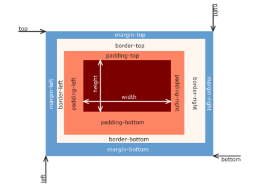
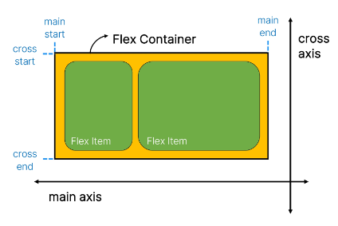

# 9/5 강의
## CSS Box Model
> 모든 HTML 요소를 사각형 박스로 표현하는 개념<br/>
> `내용(content), 안쪽 여백(padding), 테두리(border), 외부 간격(margin)`
- Content
    - 콘텐츠가 표시되는 영역
- Border
    - 콘텐츠와 패딩을 감싸는 테두리 영역 
- Padding
    - 콘텐츠 주위에 위치하는 공백 영역
- Margin
    - 이 박스와 다른 요소 사이의 공백, 가장 바깥족 영역
### Box 구성 방향 별 명칭

#### [01-part-of-box](../02-box-model/01-part-of-box.html)
### width & height 속성
- 너비와 높이는 콘텐츠 영역을 대상으로 함
    - padding과 border가 더해지면 200px이 아니게 됨
- 너비와 높이를 border 기준으로 변경
    ```css
    .border-box {
      box-sizing: border-box;
    }
    ```
#### [02-box-sizing](../02-box-model/02-box-sizing.html)
### Normal flow
> CSS를 적용하지 않았을 경우 웹페이지 요소가 기본적으로 배치되는 방향
- Inline Direction
    - 새로운 행으로 나뉘지 않음
    - width와 height 속성을 사용할 수 없음
    - 수직 방향
        - padding, margins, borders가 적용되지만 다른 요소를 밀어낼 수는 없음
    - 수평 방향
        - padding, margins, borders가 적용되어 다른 요소를 밀어낼 수 있음
    - a, img, span
        
- Block Direction
    - 항상 새로운 행으로 나뉨
    - width와 height 속성을 사용하여 너비와 높이를 지정할 수 있음
    - 기본적으로 width 속성을 지정하지 않으면 박스는 inline 방향으로 사용가능한 공간을 모두 차지함
        (너비를 사용가능한 공간의 100%로 채우는 것)
    - h1~6, p, div
#### [03-block-inline](../02-box-model/03-block-inline.html)
### 기타 display 속성
1. inline-block
    - inline과 block 요소 사이의 중간 지점을 제공하는 display값
    - block 요소의 특징을 가짐
        - widht 및 height 속성 사용 가능
        - padding, margin 및 border로 인해 다른 요소가 밀려남
    - 요소가 줄 바꿈 되는 것을 원하지 않으면서 너비와 높이를 적용하고 싶은 경우에 사용
#### [04-inline-block](../02-box-model/04-inline-block.html)
2. none
    - 요소를 화면에 표시하지 않고, 영역조차 없음
#### [05-none](../02-box-model/05-none.html)

## CSS Layout Position
> Display, Position, Float, Flexbox
### CSS Position
> 요소를 Normal Flow에서 제거하여 다른 위치로 배치하는 것<br/>
> 다른 요소 위에 올리기, 화면의 특정 위치에 고정시키기 등
- 이동방향: top, bottom, left, right, Z Axis
1. static
    - 기본값
2. relative
    - 요소를 Normal Flow에 따라 배치
    - 자기 자신의 static을 기준으로 이동
    - 요소가 차지하는 공간은 static일 때와 같음
3. absolute
    - 요소를 Normal Flow에서 제거
    - 문서에서 요소가 차지하는 공간이 없어짐
        - static의 자리가 빈 공간이 돼서 다른 요소들이 이동할 수 있음
    - 가장 가까운 `relative 부모 요소를 기준`으로 이동 (없으면 body를 기준으로 이동)
        - absolute가 움직일 기준점을 명확히 해줘야 함
4. fixed
    - 요소를 Normal Flow에서 제거
    - 현재 `화면영역(viewport)을 기준`으로 이동
    - 문서에서 요소가 차지하는 공간이 없어짐
5. sticky
    - 요소를 Normal Flow에 따라 배치
    - 요소가 일반적인 문서 흐름에 따라 배치되다가 스크롤이 특정 `임계점에 도달하면 그 위치에 고정됨(fixed)`
    - 만약 다음 sticky 요소가 나오면 다음 sticky 요소가 이전 sticky요소의 자리를 대체
        - 이전 sticky 요소가 고정되어 있던 위치와 다음 sticky  요소가 고정되어야 할 위치가 겹치게 되기 때문
#### [01-position](../03-css-layout-position/01-position.html)
#### [02-sticky](../03-css-layout-position/02-sticky.html)
#### [03.absolute](../03-css-layout-position/03.absolute.html)
### Z-index
> 요소가 겹쳤을 때 어떤 요소 순으로 위에 나타낼 지 결정
- 정수 값을 사용해 Z축 순서를 지정
- 더 큰 값을 가진 요소가 작은 값의 요소를 덮음
#### [04-z-index](../03-css-layout-position/04-z-index.html)

## CSS Layout Flexbox
### CSS Flexbox
> 요소를 행과 열 형태로 배치하는 1차원 레이아웃 방식
#### Flexbox 기본 사항

- Flex Container가 item들을 이동 시킴
- `main axis(주 축)`, cross axis(교차 축)
    - main start, main end : 기본 시작점
- Flex container:
    - display: flex; 혹인 display: inline-flex; 가 설정된 부모 요소
    - 이 컨테이너의 1차 자식 요소들이 Flex Item이 됨
    - flexbox 속성 값들을 사용하여 자식 요소 Flex Item들을 배치
- Flex Item:
    - Flex Container 내부에 레이아웃 되는 항목
### 레이아웃 구성
#### [01-flexbox](../04-css-layout-flexible-box/01-flexbox.html)
#### [02-flexbox-grow](../04-css-layout-flexible-box/02-flexbox-grow.html)
#### [03-flexbox-basis](../04-css-layout-flexible-box/03-flexbox-basis.html)
#### [04-flexbox-responsive](../04-css-layout-flexible-box/04-flexbox-responsive.html)