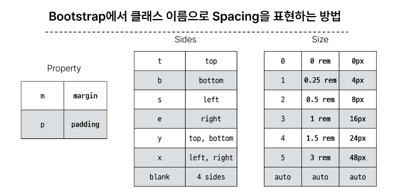
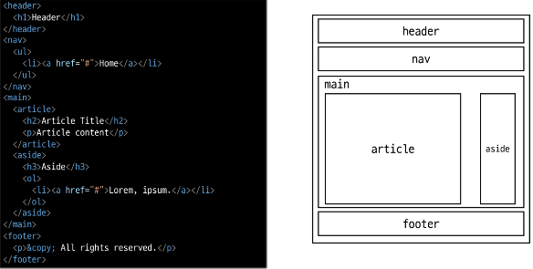

# 9/6 강의
## Bootstrap
> CSS 프론트엔드 프레임워크
- [Bootstrap_공식_문서](https://getbootstrap.com/)
### 기본 사용법
```html
<!-- mt-5 -->
<!-- {property}{sides}-{size} -->
<p class="mt-5">Hello, world!</p>
```
#### 클래스 이름으로 Spacing 표현하기


### Typograpy
> 제목, 본문 텍스트, 목록 등
- 공식 문서 확인하기
- [Bootstrap_Typograpy](https://getbootstrap.com/docs/5.3/content/typography/)
#### Display headings
```css
<p class="display-1~6"></p>
```
#### Inline text elements
```css
<mark>강조</mark>
<del>취소선</del>
<s>no longer accurate</s>
<ins>an addition to the doucument</ins>
<u>밑줄</u>
<small>얇은 글씨체</small>
<strong>굵은 글씨체</strong>
<em>이탤릭체</em>
```
#### List
```css
/* 자식 리스트의 스타일이 리스트가 아닌 것 처럼 보이게 함 */
<ul class="list-unstyled"></ul>
```
#### [01-typhography](../05-fundamentals-of-bootstrap/01-typhography.html)

### Color
- [Bootstrap_Colors](https://getbootstrap.com/docs/5.3/utilities/colors/)
- [Bootstrap_Background](https://getbootstrap.com/docs/5.3/utilities/background/)
#### [02-colors](../05-fundamentals-of-bootstrap/02-colors.html)
#### [실습](../05-fundamentals-of-bootstrap/03-box.html)

### Bootstrap Component
> Bootstrap에서 제공하는 `UI 관련 요소(버튼, 네비게이션바, 카드, 폼, 드롭다운 등)`
- Alerts
- Badges
- Buttons
- Cards
- Navbar
#### [04-components](../05-fundamentals-of-bootstrap/04-components.html)
#### [05-carousel](../05-fundamentals-of-bootstrap/05-carousel.html)
#### [06-modal](../05-fundamentals-of-bootstrap/06-modal.html)

## Semantic Web
> 웹 데이터를 의미론적으로 구조화된 형태로 표현하는 방식
### Semantic in HTML
> 기본적 모양과 기능 외에 의미를 가지는 HTML 요소<br/>
> 검색엔진 및 개발자가 웹 페이지 콘텐츠를 이해하기 쉽도록
- header
- nav
- main
- article
- section
- aside
- footer
#### semantic element 예시

#### [01-semantic-element](../06-semantic-web/01-semantic-element.html)

### Semantic in CSS
#### OOCSS
> Object Oriented CSS (CSS를 구성하는 방법론)
- 기본 원칙
    - 구조와 스킨을 분리
        - 재사용 가능성 높이기
    - 컨테이너와 콘텐츠를 분리
        - 객체를 둘러싸는 컨테이너에 스타일을 적용
        - 위치에 의존적인 스타일을 사용하지 않도록 함
        - 콘텐츠를 다른 컨테이너로 이동시키거나 재배치할 때 스타일이 깨지는 것을 방지
#### [02-oocss](../06-semantic-web/02-oocss.html)
