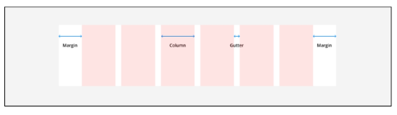
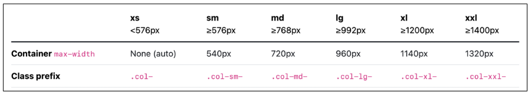

# 9/7 강의
## Bootstrap Grid system
> 웹페이지의 레이아웃을 조정하는 데 사용되는 `12개의 컬럼`으로 구성된 시스템
- 목적: 반응형 디자인을 지원해 웹 페이지를 다양한 기기에서 적절하게 표시할 수 있도록 도움
### 클래스와 기본 구조
1. Container: Column들을 담고 있는 공간
2. Column: 실제 컨텐츠를 포함하는 부분
3. Gutter: 컬럼과 컬럼 사이의 여백 영역
    - x축 : padding, y축 : margin 으로 컨트롤

#### [01-grid-system](../07-bootstrap-grid-system/01-grid-system.html)

## Grid system for responsive web
### Responsive Web Design
> Bootstrap grid system에서는 12개의 column과 `6개의 breakpoins`를 사용하여 반응형 웹 디자인을 구현
### Grid system Breakpoints
> 웹 페이지를 다양한 화면 크기에서 적절하게 배치하기 위한 분기점
- 6개의 분기점 : xs, sm, md, lg, xl, xxl

- 각 breakpoints 마다 설정된 최대 너비 값 `이상으로` 화면이 커지면 grid system 동작이 변경됨
#### [01-breakpoints](../08-grid-system-for-responsive-web/01-breakpoints.html)

## 참고
### The Grid System
- 편집 디자인에서 나온 개념
- 정보 구조와 배열을 체계적으로 작성하여 질서를 부여하는 시스템
### Grid cards
> 카드를 위한 그리드 시스템
- row에서 col들을 컨트롤
#### [02-grid-cards](../08-grid-system-for-responsive-web/02-grid-cards.html)