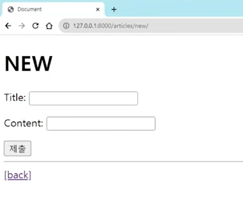
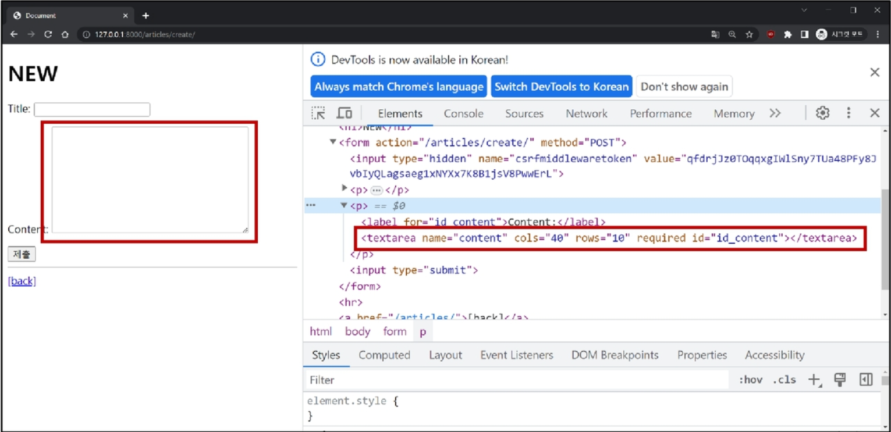

# 9/26 강의
## 개요
### HTML 'form'
- 사용자로부터 데이터를 받기위해 활용한 방법
- 비정상적 혹은 악의적인 요청을 필터링할 수 없음
    - 유효한 데이터인지에 대한 확인이 필요

### 유효성 검사
- 수집한 데이터가 정확하고 유효한지 확인하는 과정

#### 구현
- 유효성 검사를 구현하는 데에는 고려해야할 것이 많음
- Django가 제공하는 Form을 사용

## Django Form
- 사용자 입력 데이터를 수집하고, 처리 및 유효성 검사를 수행하기 위한 도구
    - 유효성 검사를 단순화 하고 자동화 할 수 있는 기능을 제공

### Form class 정의
```python
# articles/forms.py (새 파일 생성)

from django import forms

class ArticleForm(forms.Form):
    title = forms.CharField(max_length=10)
    # forms에는 TextField가 없음, CharField의 max_length 인자는 필수가 아님
    content = forms.CharField()
```

### Form Class를 적용한 new 로직
```python
# articles/views.py

# views 함수에 ArticleForm을 import 하여
from .forms import ArticleForm

def new(request):
    # context에서 사용한다
    form = ArticleForm()
    context = {
        'form': form,
    }
    return render(request, 'articles/new.html', context)
```

```html
<!-- artilces/new.html -->

  <h1>NEW</h1>
  <form action="" method="POST">
    
    {{ form.as_p }}
    <!-- as_p : label, input쌍을 p태그로 감싸기  -->
    <input type="submit">
  </form>
```
#### 결과


### Widgets
- HTML 'input' element의 표현을 담당
    - input 요소의 속성 및 출력되는 부분을 변경하는 것
```python
# articles/forms.py

from django import forms

class ArticleForm(forms.Form):
    title = forms.CharField(max_length=10)
    # widget 사용
    content = forms.CharField(widget=forms.Textarea)
```
####


## Django Model Form
### Form vs ModelForm
- Form: 사용자 입력 데이터를 DB에 저장하지 않을 때 (ex. 로그인)
- ModelForm: 사용자 입력 데이터를 DB에 저장해야 할 때 (ex. 게시글, 회원가입)

### ModelForm
- Model과 연결된 Form을 자동으로 생성해주는 기능을 제공

### ModelForm class 정의
```python
# articles/forms.py

from django import forms
# model을 import해와서
from .models import Article

class ArticleForm(forms.ModelForm):
    # model 등록
    class Meta:
        model = Article
        fields = '__all__'  # 사용자로부터 입력받는 모든 필드를 등록
        # widget을 사용하지 않아도 필드 속성을 맞춰준다
        # fields = ('title',)   # title을 등록
        # exclude = ('title',)  # title을 제외하고 등록
```

### ModelForm Class를 적용한 create 로직
#### is_vaild()
- 유효성 검사를 실행하고, 데이터가 유효한지 여부를 Boolean으로 반환

```python
# articles/views.py

from .forms import ArticleForm

def create(request):
    form = ArticleForm(request.POST)
    # 유효성 검사 진행
    # 유효성 검사가 통과된 경우
    # 유효성 검사에 실패한 경우 에러메세지가 포함되어 다음코드 진행
    if form.is_valid():
        article = form.save()
        return redirect('articles:detail', article.pk)
    context = {
        'form': form,
    }  
    return render(request, 'articles/new.html', context)
```

### ModelForm Class를 적용한 edit 로직
```python
# articles/views.py

def edit(request, pk):
    article = Article.objects.get(pk=pk)
    # form의 데이터를 article의 데이터로 채움
    form = ArticleForm(instance=article)
    context = {
        'article': article,
        'form': form,
    }
    return render(request, 'articles/edit.html', context)
```

```html
<!-- articles/edit.html -->

<h1>Edit</h1>
  <form action="" method="POST">
    
    {{ form.as_p }}
    <input type="submit">
  </form>
```

### ModelForm Class를 적용한 update로직
```python
# artilces/views.py

def update(request, pk):
    article = Article.objects.get(pk=pk)
    # 수정할 instance를 표시해줘야 함
    form = ArticleForm(request.POST, instance=article)
    if form.is_vaild():
        form.save()
        return redirect('articles:detail', article.pk)
    context = {
        'form': form,
    }
    return render(request, 'articles/edit.html', context)
```

### save()
- 키워드 인자 `instance`의 여부를 통해 생성할 지, 수정할 지를 결정
```python
# CREATE
form = ArticleForm(request.POST)
form.save()

# UPDATE
form = ArticleForm(request.POST, instance=article)
form.save()
```

## 참고
### Widget 응용
```python
# articles/forms.py

class ArticleForm(forms.ModelForm):
    title = forms.CharField(
        label='제목',
        widget=forms.TextInput(
            attrs={
                # css class 적용
                'class': 'my-title',
                'placeholder': 'Enter the title',
            }
        )
    )

    class Meta:
        model = Article
        fields = '__all__'
```

## Handling HTTP requests
### view 함수 구조 변화
- new & create view 함수 간 공통점과 차이점
    - 공통점 : 목적 (데이터 생성을 구현하기 위함)
    - 차이점 
        - new: GET method 요청만 처리
        - create: POST method 요청만 처리
- -> 둘을 합쳐 분기처리
### new & create 함수 결합
```python
# articles/views.py

def create(request):
    # 요청의 메서드가 POST라면(create)
    if request.method == 'POST':
        form = ArticleForm(request.POST)
        if form.is_vaild():
            article = form.save()
            return redirect('artices:detail', article.pk)
    # 요청의 메서드가 POST가 아니라면(new)
    else:
        form = ArticleForm()
    context = {
        'form': form,
    }
    # articles/new.html의 이름을 create로 변경
    # new를 사용하는 모든 곳을 수정해야함
    return render(request, 'articles/create.html', context)
```

### edit & update 함수 결합
```python
# articles/views.py

def update(request, pk):
    article = Article.objects.get(pk=pk)
    if request.method == 'POST':
        form = ArticleForm(request.POST, instance=article)
        if form.is_vaild():
            form.save()
            return redirect('articles/detail.html', article.pk)
    else:
        form = ArticleForm(instance=article)
    context = {
        'article': article,
        'form': form,
    }
    # articles/edit.html의 이름을 update로 변경
    # update를 사용하는 모든 곳을 수정해야함
    return render(request, 'articles/update.html', context)
```