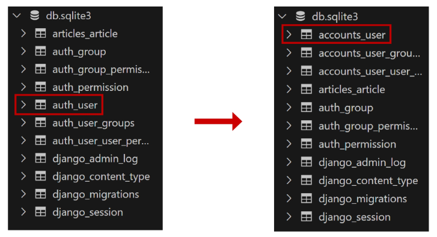

# 10/4 강의
## Cookie & Session
### 개요
- 우리가 서버로부터 받은 페이지를 둘러볼 때 우리는 서버와 서로 연결되어 있는 상태가 아니다.
- HTTP
    1. 비 연결 지향 (connectionless)
        - 서버는 요청에 대한 응답을 보낸 후 연결을 끊음
    2. 무상태 (stateless)
        - 연결을 끊는 순간 클라이언트와 서버 간의 통신이 끝나며 상태 정보가 유지되지 않음
            - 장바구니에 담은 상품을 유지할 수 없음
            - 로그인 상태를 유지할 수 없음

### 쿠키
- `서버`가 사용자의 웹 `브라우저`에 전송하는 작은 데이터 조각
    - 클라이언트 측에서 `저장`되는 작은 데이터 파일이며, `사용자 인증, 추적, 상태 유지 등에 사용`되는 데이터 저장 방식

#### 쿠키 사용 예시
1. 브라우저가 웹 페이지 request
2. 서버는 페이지와 쿠키를 send
3. 브라우저는 쿠키를 저장
4. 같은 서버에 다른 페이지로 재요청시마다 받고 저장해 놓았던 쿠키를 함께 전송

#### 쿠키 사용 원리
1. 브라우저(클라이언트)는 쿠키를 `Key-Value`형식으로 저장
2. 동일한 서버에 재요청시 저장된 쿠키를 함께 전송
- 두 요청이 동일한 브라우저에서 들어왔는지 아닌지 판단할 때 주로 사용
    - 이를 사용해서 사용자의 로그인 상태를 유지할 수 있음
    - 상태가 없는 HTTP 프로토콜에서 상태 정보를 기억 시켜주기 때문

#### 쿠키를 이용한 장바구니 (쿠팡)
- 개발자 도구 - Network 탭 - cartView.pang 확인
- 서버는 응답과 함께 `Set-Cookie` 응답 헤더를 브라우저에게 전송
    - 이 헤더는 클라이언트에게 쿠키를 저장하라고 전달하는 것

#### 쿠키 사용 목적
1. 세션 관리 (Session management)
    - 로그인, 아이디 자동완성, 공지 하루 안 보기, 팝업 체크, 장바구니 등의 정보 관리
2. 개인화 (Personalization)
    - 사용자 선호, 테마 등의 설정
3. 트래킹 (Tracking)
    - 사용자 행동을 기록 및 분석

### 세션(Sesseion)
- 서버 측에서 생성 되어 클라이언트 - 서버간의 상태 유지
- 상태 정보를 저장하는 데이터 저장 방식
> 쿠키에 세션 데이터를 저장하여 매 요청시 마다 세션 데이터를 함께 보냄

#### 세션 작동 원리
1. 클라이언트가 로그인을 하면 `session 데이터를 생성 후 저장`(DB)
2. 생성된 session 데이터에 인증할 수 있는 `id(key)를 발급`
3. 발급한 session id를 `클라이언트에게 응답`
4. 클라이언트는 응답 받은 session id를 `쿠키에 저장`
5. 클라이언트가 다시 동일한 서버에 접속하면 요청과 `쿠키(session id가 저장된)`를 서버에 전달
6. session id를 확인해 `로그인 되었다는 것을 알도록 함`

#### 쿠키와 세션의 목적
- 서버와 클라이언트 간의 상태를 유지

## 참고
### 쿠키 종류별 Lifetime(수명)
1. Session cookie
    - 현재 세션이 종료되면 삭제됨
    - 브라우저 종료와 함께 세션이 삭제됨
2. Persistent cookies
    - Expires 속성에 지정된 날짜 혹은 Max-Age 속성에 지정된 기간이 지나면 삭제됨

### 세션 in Django
- `database-backed sessions` 저장 방식을 기본 값으로 사용
- session 정보는 DB의 django_session 테이블에 저장
- Django는 특정 session id를 포함하는 쿠키를 사용해서 각각의 브라우저와 사이트가 연결된 session을 알아냄

## Authentication System
### Django Authentication System(인증 시스템)
- 사용자 인증과 관련된 기능을 모아놓은 시스템

### 사전 준비
- 두 번째 app `accounts` 생성 및 등록
    - auth와 관련한 경로나 키워드들을 django 내부적으로 accounts라는 이름으로 사용하고 있기 때문에 되도록 `'accounts'로 지정하는 것을 권장`

## Custom User model
- django가 기본적으로 제공하는 User model은 내장된 auth 앱의 User클래스를 사용
- 내장된 User 클래스는 간편하지만, `직접 수정할 수 없음`
```python
# 내장된 auth 앱
# settings.py

INSTALLED_APPS = [
    ...,
    'django.contrib.auth',
    ...
```

### Custom User model로 `대체`하기
- AbstractUser를 상속받는 커스텀 User 클래스 작성
    - 기존 User 클래스도 AbstractUser를 상속받기 때문에
    - `커스텀 User 클래스도 기존 User 클래스와 완전히 같은 모습을 가지게 됨`
```python
# accounts/models.py

from django.contrib.auth.models import AbstractUser


class User(AbstractUser):
    # pass해 두고 필요할 때 수정
    pass
```

- django 프로젝트가 사용하는 기본 User 모델을 우리가 작성한 User 모델로 지정
    - 수정 전 기본 값은 `auth.User`
```python
# setting.py

# 대체한 유저 모델을 사용할 것
AUTH_USER_MODEL = 'accounts.User'
```

- admin site에 모델 등록
    - 기본 User 모델이 아니기 때문에 등록하지 않으면 admin site에 출력되지 않음
```python
# accounts/admin.py

from django.contrib import admin
from django.contrib.auth.admin import UserAdmin
from .models import User


admin.site.register(User, UserAdmin)
```

- 사용 User 테이블 변화


#### `주의`
- 프로젝트 중간에 AUTH_USER_MODEL을 변경할 수 없음
    - 이미 프로젝트가 진행되고 있을 경우 데이터베이스 초기화 후 진행
- 기본 User 모델이 충분하더라도 커스텀할 것을 강하게 권장
    - `필요한 경우 나중에 맞춤 설정할 수 있기 때문`
- 프로젝트의 모든 migrations 혹은 첫 migrate를 실행하기 전에 이 작업을 마쳐야 함

## Login
- Session을 Create하는 과정 (create 구조)

### AuthenticationForm()
- 로그인 인증에 사용할 데이터를 입력 받는 built-in form
    - 로그인은 DB에 데이터를 저장하는 과정이 아니기 때문에 ModelForm이 아닌 Form 사용
- login(request, user)
    - AuthenticationForm을 통해 인증된 사용자를 로그인 하는 함수
- get_user()
    - AuthenticationForm의 인스턴스 메서드
    - 유효성 검사를 통과했을 때 로그인 한 사용자 객체를 반환

### 로그인 페이지 작성
```python
# accounts/urls.py

app_name = 'accounts'
urlpatterns = [
    path('login/', views.login, name='login'),
]
```
```python
# accounts/views.py

from django.contrib.auth.forms import AuthenticationForm

def login(request):
    if request.method == 'POST':
        pass
    # 이 부분이 로그인 페이지
    else:
        form = AuthenticationForm()
    context = {
        'form': form,
    }
    return render(request, 'accounts/login.html', context)
```
```html
<!-- accounts/login.html -->

  <h1>로그인</h1>
  <form action="" method="POST">
    
    {{ form.as_p }}
    <input type="submit">
  </form>
```

### 로그인 로직 작성
```python
# accounts/views.py

from django.shortcuts import render, redirect
# login 함수 이름과 겹쳐서 보통 import하는 login함수의 이름을 바꾼다.
from django.contrib.auth import login as auth_login

def login(request):
    # 이 부분이 로그인 로직
    if request.method == 'POST':
        form = AuthenticationForm(request, request.POST)
        # form = AuthenticationForm(request, data=request.POST)
        if form.is_valid():
            # 로그인 (세션 데이터 생성)
            # login(request, user)
            auth_login(request, form.get_user())
            return redirect('articles:index')
    else:
        form = AuthenticationForm()
    context = {
        'form': form,
    }
    return render(request, 'accounts/login.html', context)
```

### 세션 데이터 확인
1. 로그인 후 발급받은 세션 확인
- django_session 테이블에서 확인
2. 브라우저에서 확인
- 개발자도구 - Application - Cookies

### 로그인 링크 작성
```html
<!-- articles/index.html -->

<h1>INDEX</h1>
<a href="">LOGIN</a>
```

## Logout
- Session을 Delete하는 과정 (delete 구조)
- logout(request)
    - 현재 요청에 대한 Session Data를 DB에서 삭제
    - 클라이언트의 쿠키에서도 Session id를 삭제

### 로그아웃 로직 작성
```python
# accounts/urls.py

app_name = 'accounts'
urlpatterns = [
    path('login/', views.login, name='login'),
    path('logout/', views.logout, name='logout'),
]
```
```python
# accounts/views.py

from django.contrib.auth import logout as auth_logout

def logout(request):
    auth_logout(request)
    return redirect('articles:index')
```
```html
<!-- articles/index.html -->

<form action="" method="POST">
  
  <input type="submit" value="LOGOUT">
</form>
```

## Template with Authentication data
- 템플릿에서 인증 관련 데이터를 출력하는 방법

### 현재 로그인 되어있는 유저 정보 출력하기
```html
<!-- articles/index.html -->

<!-- context로 받아오지 않아도 정보가 출력된다. -->
<!-- 그 이유는 context processors -->
<h3>{{ user.username }}님 안녕하세요!</h3>
```

### context processors
- 템플릿이 렌더링 될 때 호출 가능한 컨텍스트 데이터 목록
- 작성된 컨텍스트 데이터는 기본적으로 템플릿에서 사용 가능한 변수로 포함됨
- 즉, django에서 자주 사용하는 데이터 목록을 미리 템플릿에 로드 해 둔 것
```python
# settings.py

TEMPLATES = [
    {
        ...,
        'OPTIONS': {
            'context_processors': [
                'django.template.context_processors.debug',
                'django.template.context_processors.request',
                # 이 부분이다
                'django.contrib.auth.context_processors.auth',
                'django.contrib.messages.context_processors.messages',
            ],
        },
    },
]
```


## 참고
### github
- [AuthenticationForm()](https://github.com/django/django/blob/main/django/contrib/auth/forms.py#L199)
- [AuthenticationForm의 get_user 인스턴스 메서드](https://github.com/django/django/blob/main/django/contrib/auth/forms.py#L269)

### User 모델 상속 관계
- models.Model -> class AbstractBaseUser -> class AbstractUser -> class User

### 'AbstractUser' class
- 관리자 권한과 함께 완전한 기능을 가지고 있는 User model을 구현하는 `추상 기본 클래스`

### 'Abstract base classes (추상 기본 클래스 / ABC)
- 몇 가지 공통 정보를 여러 다른 모델에 넣을 때 사용하는 클래스
- 데이터베이스 테이블을 만드는 데 사용되지 않으며,<br>
다른 모델의 기본 클래스로 사용되는 경우 해당 필드가 하위 클래스의 필드에 추가 됨
- https://docs.python.org/3/library/abc.html