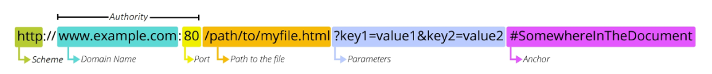

# 10/18 강의
## REST API
### API
> Application Programming Interface
- 클라이언트와 서버처럼 서로 다른 프로그램에서 요청과 응답을 받을 수 있도록 만든 체계

### Web API
- 웹 서버 또는 웹 브라우저를 위한 API
- Open API

### REST
> Representational State Transfer
- API Server를 개발하기 위한 일종의 소프트웨어 설계 방법론
- RESTful 하다
- `자원을 정의`하고 `자원에 대한 주소를 지정`하는 전반적인 방법을 서술

### REST API
- REST 설계 디자인을 지켜서 설계한 API

#### REST에서 자원을 정의하고 주소를 지정하는 방법
1. 자원의 식별
    - URI
2. 자원의 행위
    - HTTP Methods
3. 자원의 표현
    - JSON 데이터
    - 궁극적으로 표현되는 데이터 결과물

### 자원의 식별
#### URI
> Uniform Resource Identifier (통합 자원 식별자)
- 인터넷에서 리소스(자원)를 식별하는 문자열
    - 가장 일번적인 URI는 웹 주소로 알려진 URL
#### URL
> Uniform Resource Locator (통합 자원 위치)
- 웹에서 주어진 리소스의 주소
    - 네트웨크 상에 리소스가 어디 있는지를 알려주기 위한 약속

##### 

##### Schemp (or Protocol)
- 브라우저가 리소스를 요청하는 데 사용하는 규약
- URL 첫 부분은 브라우저가 어떤 규약을 사용하는지를 나타냄
- 기본적으로 웹은 HTTP(S)를 요구한다.

##### Domain Name
- 요청 중인 웹 서버
- IP 주소를 외우기 쉽게 Domain Name으로 사용
    - google.com의 IP주소는 142.251.42.142

#### Port
- 웹 서버의 리소스에 접근하는 데 사용되는 기술적인 문(Gate)
- HTTP 프로토콜의 표준 포트
    - HTTP - 80
    - HTTPS - 443
- 표준 포트만 생략 가능

#### Path
- 웹 서버의 리소스 경로
- 초기에는 실제 파일이 위치한 물리적 위치였지만<br>
    오늘 날은 추상화된 형태의 구조를 표현
    - /articles/create/가 실제 articles 폴더 안에 create폴더를 나타내는 것은 아님

#### Parameter
- GET 검색
- 웹 서버에 제공하는 추가적인 데이터
- '&' 기호로 구분되는 key-value 쌍 목록
- 서버는 리소스를 응답하기 전에 이러한 파라미터를 사용하여 추가 작업을 수행할 수 있음

#### Anchor
- 일종의 북마크를 나타내며 브라우저에 해당 지점에 있는 콘텐츠를 표시
- '#(fragment identifier - 부분 식별자)' 이후 부분은 `서버에 전송되지 않음` (브라우저에서 처리)

### 자원의 행위
#### HTTPS Request Methods
> 리소스에 대한 행위(수행 동작)를 정의 - HTTP verbs
1. GET
    - 서버에 리소스의 표현을 요청
    - 데이터만 검색
2. POST
    - 데이터를 지정된 리소스에 제출
    - 서버의 상태를 변경
3. PUT
    - 요청한 주소의 리소스를 수정
4. DELETE
    - 지정된 리소스를 삭제

#### HTTPS response status codes
> 특정 HTTP 요청이 성공적으로 완료 되었는지 여부를 나타냄
- Informational responses (100-199)
- Successful responses (200-299)
- Redirection messages (300-399)
- Client error responses (400-499)
- Server error responses (500-599)

### 자원의 표현
- REST API는 `JSON`타입 권장
- 그동안 서버가 응답했던 것(django-template)
    - 페이지(html)만 응답하고 있었음

#### 타입의 변화
- Django는 더 이상 Template 부분에 대한 역할을 담당하지 않으며,
- Front-end Framework에서 JSON파일을 표현

### python으로 json 응답 받기
#### [99-json-response-practice](../99-json-response-practice/)
```bash 
# 사전 준비
$ python manage.py migrate
$ python manage.py loaddata articles.json
```
```python
import requests
from pprint import pprint


response = requests.get('http://127.0.0.1:8000/api/v1/articles/')

# json을 python 타입으로 변환
result = response.json()

# 파이썬으로 결과 출력
# print(type(result))
# pprint(result)
pprint(result[0])
# pprint(result[0].get('title'))
```

## DRF
> Django REST framework
- Django에서 Restful API 서버를 쉽게 구축할 수 있도록 도와주는 오픈소스 라이브러리

### Serialization
> `직렬화`
- 여러 시스템에서 활용하기 위해서<br>
    데이터 구조나 객체 상태를 나중에 재구성할 수 있는 포맷으로 변환하는 과정

## DRF with Single Model
### [10-01-django-rest-framework](../10-01-django-rest-framework/)
```bash 
# 사전 준비
$ python manage.py migrate
$ python manage.py loaddata articles.json
```

#### URL과 HTTP Request method 설계
|URL|GET|POST|PUT|DELETE|
|:--:|:--:|:--:|:--:|:--:|
|articles/|전체 글 조회|글 작성|||
|articles/1/|1번 글 조회||1번 글 수정|1번 글 삭제|

### GET
#### GET - List : 게시글 데이터 목록 조회하기
- 게시글 데이터 목록을 제공하는 ArticleListSerializer 정의
```python
# articles/serializers.py

from rest_framework import serializers
from .models import Article


class ArticleListSeriallizer(serializers.ModelSerializer):
# ModelSerializer: Django 모델과 연결된 Serializer 클래스
    class Meta:
        model = Article
        # fields = '__all__'
        fields = ('id', 'title', 'content',)
```

- url 및 view 함수 작성
```python
# articles/urls.py

urlpatterns = [
    path('articles/', views.article_list),
]
```
```python
# articles/views.py

from rest_framework.response import Response
from rest_framework.decorators import api_view

from .models import Article
from .serializers import ArticleListSeriallizer


@api_view(['GET'])
def article_list(request):
    articles = Article.objects.all()
    serializer = ArticleListSeriallizer(articles, many=True)
    # JSON 데이터로 serialization하여 페이지 없이 응답
    return Response(serializer.data)
```

#### 이전 view 함수와 비교
```python
# HTML에 출력되도록 페이지와 함께 응답했던 과거의 view 함수

def index(request):
    articles = Article.objects.all()
    context = {
        'articles': articles,
    }
    return render(request, 'articles/index.html', context)
```

#### 'api_view' decorator
- DRF view 함수에서는 필수로 작성
- view 함수를 실행하기 전 HTTP 메서드를 확인
- DRF view 함수가 응답해야 하는 HTTP 메서드 목록을 작성
- 다른 메서드 요청에 대해서 405 Method Not Allowed로 응답

#### GET - Detail : 단일 게시글 데이터 조회하기
- 각 게시글의 상세 정보를 제공하는 ArticleSerializer 정의
```python
# articles/serializers.py

class ArticleSeriallizer(serializers.ModelSerializer):
    class Meta:
        model = Article
        fields = '__all__'
```

- url 및 view 함수 작성
```python
# articles/urls.py

urlpatterns = [
    ...,
    path('articles/<int:article_pk>/', views.article_detail),
]
```
```python
# articles/views.py

@api_view(['GET'])
def article_detail(request, article_pk):
    article = Article.objects.get(pk=article_pk)
    serializer = ArticleSeriallizer(article)
    return Response(serializer.data)
```

### POST : 게시글 생성하기
- article_list view 함수 구조 변경 (method에 따른 분기 처리)
```python
# articles/views.py

from rest_framework import status
# 데이터 생성이 성공했을 경우 201 Created 응답
# 데이터 생성이 실패 했을 경우 400 Bad request를 응답

@api_view(['GET', 'POST'])
def article_list(request):
    if request.method == 'GET':
        articles = Article.objects.all()
        serializer = ArticleListSeriallizer(articles, many=True)
        return Response(serializer.data)
    
    # HTTP Request method를 명시해준다.
    elif request.method == 'POST':
        serializer = ArticleSeriallizer(data=request.data)
        if serializer.is_valid():
            serializer.save()
            return Response(serializer.data, status=status.HTTP_201_CREATED)
        return Response(serializer.errors, status=status.HTTP_400_BAD_REQUEST)
```

### DELETE : 게시글 데이터 삭제하기
- article_detail view 함수 구조 변경 (method에 따른 분기 처리)
```python
# articles/views.py

@api_view(['GET', 'DELETE'])
def article_detail(request, article_pk):
    article = Article.objects.get(pk=article_pk)

    if request.method == 'GET':
        serializer = ArticleSeriallizer(article)
        return Response(serializer.data)
    
    elif request.method == 'DELETE':
        article.delete()
        # 요청에 대한 데이터 삭제가 성공했을 경우는 204 No Content 응답
        return Response(status=status.HTTP_204_NO_CONTENT)
```

### PUT : 게시글 데이터 수정하기
- article_detail view 함수 구조 변경 (method에 따른 분기 처리)
```python
# articles/views.py

@api_view(['GET', 'DELETE', 'PUT'])
def article_detail(request, article_pk):
    article = Article.objects.get(pk=article_pk)

    ...

    elif request.method == 'PUT':
        serializer = ArticleSeriallizer(article, data=request.data)
        # serializer = ArticleSeriallizer(instance=article, data=request.data)
        if serializer.is_valid():
            serializer.save()
            # 요청에 대한 데이터 수정이 성공했을 경우는 200 OK 응답
            return Response(serializer.data)
        return Response(serializer.errors, status=status.HTTP_400_BAD_REQUEST)
```

## 참고
### raise_exception
- is_valid()는 유효성 검사 오류가 있는 경우 ValidationError 예외를 발생시키는<br>
    선택적 raise_exception 인자를 사용할 수 있음
- DRF에서 제공하는 기본 예외 처리기에 의해 자동으로 처리된다
- 기본적으로 HTTP 400 응답을 반환
```python
@api_view(['GET', 'POST'])
def article_list(request):
    ...
    
    elif request.method == 'POST':
        serializer = ArticleSeriallizer(data=request.data)
        if serializer.is_valid(raise_exception=True):
            serializer.save()
            return Response(serializer.data, status=status.HTTP_201_CREATED)
        # is_valid(raise_exception=True) 를 할 경우 별도의 처리를 하지 않아도 됨
        # return Response(serializer.errors, status=status.HTTP_400_BAD_REQUEST)
```