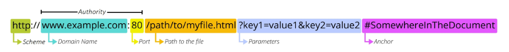

# 10/18 강의
## REST API
### API
> Application Programming Interface
- 클라이언트 - 서버처럼 서로 다른 프로그램에서 요청과 응답을 받을 수 있도록 만든 체계

### Web API
- 웹 서버 또는 웹 브라우저를 위한 API
- Open API

### REST
> Representational State Transfer
- API Server를 개발하기 위한 일종의 소프트웨어 설계 방법론
- RESTful 하다
- `자원을 정의`하고 `자원에 대한 주소를 지정`하는 전반적인 방법을 서술

### REST API
- REST 설계 디자인을 지켜서 설계한 API

#### REST에서 자원을 정의하고 주소를 지정하는 방법
1. 자원의 식별
    - URI
2. 자원의 행위
    - HTTP Methods
3. 자원의 표현
    - JSON 데이터
    - 궁극적으로 표현되는 데이터 결과물

### 자원의 식별
#### URI
> Uniform Resource Identifier (통합 자원 식별자)
- 인터넷에서 리소스(자원)를 식별하는 문자열
    - 가장 일번적인 URI는 웹 주소로 알려진 URL
#### URL
> Uniform Resource Locator (통합 자원 위치)
- 웹에서 주어진 리소스의 주소
    - 네트웨크 상에 리소스가 어디 있는지를 알려주기 위한 약속

#### 

#### Schemp (or Protocol)
- 브라우저가 리소스를 요청하는 데 사용하는 규약
- URL 첫 부분은 브라우저가 어떤 규약을 사용하는지를 나타냄

#### Domain Name
- 요청 중인 웹 서버를 나타냄
- IP 주소를 사용하는 것도 가능하지만, 사람이 외우기 어렵기 때문에 Domain Name으로 사용
    - google.com의 IP주소는 142.251.42.142

#### Port
- 웹 서버의 리소스에 접근하는 데 사용되는 기술적인 문(Gate)
- HTTP 프로토콜의 표준 포트
    - HTTP - 80
    - HTTPS - 443
- 표준 포트만 생략 가능

#### Path
- 웹 서버의 리소스 경로
- 초기에는 실제 파일이 위치한 물리적 위치였지만<br>
    오늘 날은 추상화된 형태의 구조를 표현
    - /articles/create/가 실제 articles 폴더 안에 create폴더를 나타내는 것은 아님

#### Parameter
- GET 검색
- 웹 서버에 제공하는 추가적인 데이터
- '&' 기호로 구분되는 key-value 쌍 목록

#### Anchor
- 일종의 북마크를 나타내며 브라우저에 해당 지점에 있는 콘텐츠를 표시
- '#' 이후 부분은 서버에 전송되지 않음 (브라우저에서 처리)

### 자원의 행위
#### HTTPS Request Methods
1. GET
2. POST
3. PUT
4. DELETE

#### HTTPS response status codes
- 5개의 응답 그룹

### 자원의 표현
- 그동안 서버가 응답했던 것
    - 페이지(html)만 응답하고 있었음
- REST API는 `JSON`타입 권장

#### 타입의 변화
- Django는 더 이상 Template 부분에 대한 역할을 담당하지 않으며,
- Front-end Framework에서 JSON파일을 표현

### 사전 준비
> 99-json-response-practice
```bash 
$ python manage.py loaddata articles.json
```

## DRF
> Django REST framework
- Django에서 Restful API 서버를 쉽게 구축할 수 있도록 도와주는 오픈소스 라이브러리

### Serialization
> `직렬화`
- 여러 시스템에서 활용하기 위해서<br>
    데이터 구조나 객체 상태를 나중에 재구성할 수 있는 포맷으로 변환하는 과정

## DRF with Single Model
### 사전 준비
> 10-01-django-rest-framework
```bash 
$ python manage.py loaddata articles.json
```

#### URL과 HTTP Request method 설계

### GET
#### 'api_view'

### POST
- 게시글 생성하기
- 데이터 생성이 성공했을 경우 201 Created 응답
- 데이터 생성이 실패 했을 경우 400 Bad request를 응답

### DELETE

### PUT