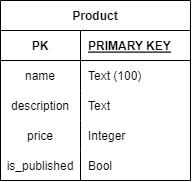
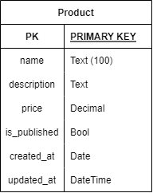

# 상품 관리 시스템 만들기

1. 앱 생성과 모델 정의
  - gitignore를 포함하여야 한다.
  - 새로운 가상 환경을 생성하고, 가상 환경 내에서 django를 설치한다.
  - project 명은 product_managament로 생성한다.
  - app 명은 goods로 생성한다.
  - 상품 정보를 담을 모델 Product를 작성한다.
      - 모델 정보
      
        

---

2. 데이터 생성과 관리
  - 관리자 계정을 생성한다.
  - 관리자 페이지에서는 Product 데이터를 관리 할 수 있어야 한다.
  - 관리자 페이지에서 Product 데이터를 최소 2개 이상 생성하시오.
  - 생성한 첫 번째 데이터는 삭제한다.
  - 두 번째 생성 데이터의 name은 '상품 관리 서비스 테스트' 로 수정한다.

---

3. 모델 수정
  - 수정된 모델 정보

    
  - price Field의 타입을 Decimal로 변경한다.
      - django 공식문서에서 DecimalField를 참고
      - 정수와 소숫점을 포함하여 최대 10자리수까지 표기한다.
      - 소숫점은 2자리수까지 표기할 수 있도록 설정한다.
  - 생성 시간과 수정 시간 정보를 담을 수 있는 필드를 추가한다.
  - 모델 변경을 완료 한 후, 관리자 페이지에서 새로운 데이터를 생성한다.
  - 새로 생성한 데이터를 수정한다.
