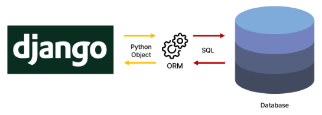
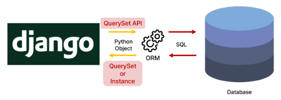

# 9/15 강의
## ORM
> Object-Relational-Mapping
- 객체 지향 프로그래밍 언어를 사용하여 호환되지 않는 유형의 시스템 간에 데이터를 변환하는 기술<br>


## QuerySet API
- ORM에서 데이터를 검색, 필터링, 정렬 및 그룹화 하는데 사용하는 도구
    - API를 사용하여 SQL이 아닌 Python 코드로 데이터를 처리<br>
    
### QuerySet API 구문
```python
# Model_class.Manager.Queryset_API
Article.objectes.all()  # 전체를 조회하는 구문
```
### Query
- 데이터베이스에 `특정한 데이터를 보여 달라는 요청`
- "쿼리문을 작성한다(보낸다)."
    - 원하는 데이터를 얻기 위해 데이터베이스에 요청을 보낼 코드를 작성한다.
- 파이썬으로 작성한 코드가 ORM에 의해 SQL로 변환되어 데이터베이스에 전달되며, 
- 데이터베이스의 응답 데이터를 ORM이 QuerySet이라는 자료 형태로 변환하여 우리에게 전달
### QuerySet
- 데이터베이스에게서 전달 받은 객체 목록(데이터 모음)
    - `순회가 가능`한 데이터로써 1개 이상의 데이터를 불러와 사용할 수 있음
- Django ORM을 통해 만들어진 자료형
- 단, 데이터베이스가 단일한 객체를 반환 할 때는 QuerySet이 아닌 모델(class)의 인스턴스로 반환됨
### QuerySet API
- Python의 `모델 클래스와` `인스턴스`를 활용해 DB에 데이터를 `저장, 조회, 수정, 삭제`하는 것
## QuerySet API 실습
### 사전 준비
#### Django shell
- Django 환경 안에서 실행되는 python shell(입력하는 QuerySet API 구문이 Django 프로젝트에 영향을 미침)
```bash
# 외부 라이브러리 설치
$ pip install ipython
$ pip install django_extensions     # shell_plus를 사용
```
```python
# django-extensions는 settings.py에 등록해줘야함
# settings.py

INSTALLED_APPS = [
    'articles',
    'django-extensions',
...,
]
```
```bash
# pip 목록 업데이트
$ pip freeze > requirements.txt 
```
```bash
# shell_plus 실행
$ python manage.py shell_plus
```
### Create
#### save()
```bash
In [1]: article = Article()

In [2]: article
Out[2]: <Article: Article object (None)>

# 인스턴스 변수 생성
In [3]: article.title = 'first'

In [4]: article.title
Out[4]: 'first'

In [5]: article.content = 'django!'

In [6]: article.content
Out[6]: 'django!'

# DB에 저장
In [7]: article.save()

In [8]: article
Out[8]: <Article: Article object (1)>   # (None) -> (1) id를 의미

In [9]: Article.objects.all()
Out[9]: <QuerySet [<Article: Article object (1)>]>

In [10]: articles = Article.objects.all()

In [11]: articles
Out[11]: <QuerySet [<Article: Article object (1)>]>

In [12]: articles[0]
Out[12]: <Article: Article object (1)>

In [24]: article
Out[24]: <Article: Article object (1)>

In [25]: article.id
Out[25]: 1

In [30]: article.pk     # primary key
Out[30]: 1

In [26]: article.title
Out[26]: 'first'

In [27]: article.content
Out[27]: 'django!'

In [28]: article.created_at
Out[28]: datetime.datetime(2023, 9, 15, 0, 41, 40, 556042, tzinfo=datetime.timezone.utc)

In [29]: article.updated_at
Out[29]: datetime.datetime(2023, 9, 15, 0, 41, 40, 556042, tzinfo=datetime.timezone.utc) 
```
```bash
In [31]: article = Article(title='second', content='django!')

In [32]: article.title
Out[32]: 'second'

In [33]: article.content
Out[33]: 'django!'

# DB에 저장
In [34]: article.save()

In [35]: article.pk
Out[35]: 2
```
```bash
In [37]: Article.objects.create(title='third', content='django!')
Out[37]: <Article: Article object (3)>
# save가 포함

In [40]: article.pk
Out[40]: 2
# 인스턴스를 생성하지 않아서 3으로 바뀌진 않음
```
### Read
#### all()
```bash
In [41]: Article.objects.all()
Out[41]: <QuerySet [<Article: Article object (1)>, <Article: Article object (2)>, <Article: Article object (3)>]>

In [42]: articles = Article.objects.all()

In [43]: for article in articles:
    ...:     print(article.title)
    ...: 
first
second
third
```
#### get()
- 객체를 찾을 수 없으면 `DoesNotExist` 예외를 발생시키고, 
- 둘 이상의 객체를 찾으면 `MultipleObjectsReturned` 예외를 발생시킴
    - `primary key`와 같이 `고유성을 보장하는 조회`에서 사용해야함
```bash
In [44]: Article.objects.get(pk=1)
Out[44]: <Article: Article object (1)>

In [45]: Article.objects.get(pk=100)
DoesNotExist: Article matching query does not exist.
```
```bash
In [46]: Article.objects.get(content='django!')
# get()은 단일 데이터 조회만 가능 -> pk로 조회 할 때만 쓰기
MultipleObjectsReturned: get() returned more than one Article -- it returned 3! 
```
#### filter()
```bash
In [47]: Article.objects.filter(content='django!')
Out[47]: <QuerySet [<Article: Article object (1)>, <Article: Article object (2)>, <Article: Article object (3)>]>
```
```bash
# 조건을 만족하는 결과가 없다면 빈 QuerySet 반환
In [48]: Article.objects.filter(content='ssafy')
Out[48]: <QuerySet []>
```
```bash
# 결과의 개수와 관계없이 QuerySet으로 반환
In [49]: Article.objects.filter(title='first')
Out[49]: <QuerySet [<Article: Article object (1)>]>
```
### Update
- 데이터 수정
    - 데이터를 `조회`하여
    - 인스턴스 변수를 변경 후 save 메서드 호출
```bash
In [50]: article = Article.objects.get(pk=1)

In [51]: article
Out[51]: <Article: Article object (1)>

In [52]: article.title = 'byebye'

In [53]: article.title
Out[53]: 'byebye'

In [54]: article.save()
```
### Delete
- 데이터 삭제
    - 데이터를 `조회`하여
    - delete 메서드 호출
```bash
In [56]: article
Out[56]: <Article: Article object (1)>

In [57]: article.delete()
Out[57]: (1, {'articles.Article': 1})

In [58]: Article.objects.get(pk=1)
DoesNotExist: Article matching query does not exist.
```
```python
In [59]: articles = Article.objects.all()

In [60]: articles
Out[60]: <QuerySet [<Article: Article object (2)>, <Article: Article object (3)>]>    

In [61]: articles.delete()
Out[61]: (2, {'articles.Article': 2})

In [62]: articles
Out[62]: <QuerySet []>
```
## 참고
### Field lookups
- 특정 레코드에 대한 조건을 설정하는 방법
- QuerySet 메서드 filter(), exclude() 및 get()에 대한 키워드 인자로 지정됨
```bash
In [66]: Article.objects.filter(content__contains='dja')
Out[66]: <QuerySet [<Article: Article object (4)>, <Article: Article object (5)>]>   
```
### ORM, QuarySet API를 사용하는 이유
- 데이터베이스 쿼리를 추상화하여 Django개발자가 데이터베이스와 직접 상호작용하지 않아도 되도록 함
- 데이터베이스와의 결합도를 낮추고 개발자가 더욱 직관적이고 생산적으로 개발할 수 있도록 도움