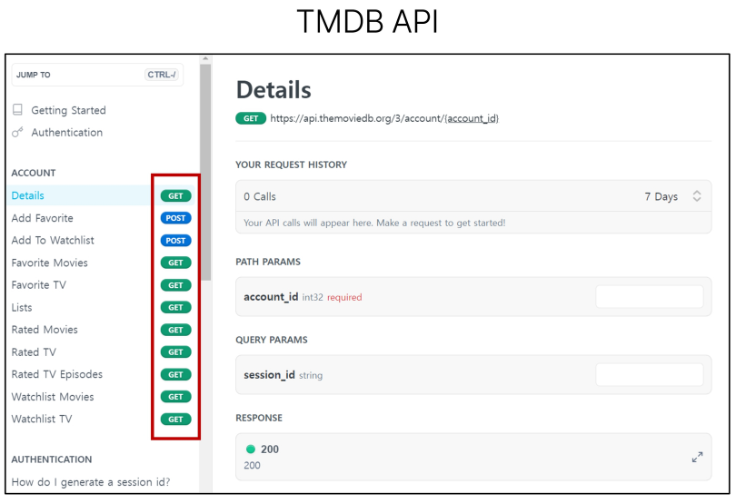

# 9/25 강의
##
```python
# articles/views.py

# models 에서 Article 클래스를 import해오기 -> DB 가져오기
from .models import Article

```

## Read
### 전체 게시글 조회
```python
# articles/views.py

def index(request):
    # QuerySet API를 사용하여 전체 데이터 가져오기
    articles = Article.objects.all()
    context = {
        'articles': articles,
    }
    return render(request, 'articles/index.html', context)
```

```html
<!-- articles/index.html -->

<h1>INDEX</h1>
<!-- 가져온 전체 데이터를 바탕으로 -->
<!-- 데이터를 하나씩 순회하며 요소들을 가져오기 -->

<p>글 번호 : {{ article.pk }}</p>
<p>글 제목 : {{ article.title }}</p>
<p>글 내용 : {{ article.content }}</p>
<hr>

```

### 단일 게시글 조회
```python
# articles/urls.py

app_name = 'articles'
urlpatterns = [
    ...,
    # <int:pk> : 숫자를 변수 pk로 받는 주소
    path('<int:pk>/', views.detail, name='detail'),
]
```

```python
# articles/views.py

def detail(request, pk):
    # 테이블 컬럼(pk)=받아온 변수(pk)
    # 받아온 pk와 일치하는 pk를 가진 DB 데이터를 article로 가져온다
    article = Article.objects.get(pk=pk)
    context = {
        'article': article,
    }
    return render(request, 'articles/detail.html', context)
```

```html
<!-- articles/detail.html -->

<h2>DETAIL</h2>
<h3>{{ article.pk }}번째 글</h3>
<hr>
<p>{{ article.title }}</p>
<p>{{ article.content }}</p>
<p>{{ article.created_at }}</p>
<p>{{ article.updated_at }}</p>
<hr>
<a href="">[back]</a>
```

```html
<!-- articles/index.html -->

<!-- index 페이지에서 detail 페이지로 가는 url -->
<a href="">
  <p>글 제목 : {{ article.title }}</p>
</a>
```

## Create
### Create 로직을 구현하기 위해 필요한 view 함수
- 사용자 입력 데이터를 받을 페이지 (new)
- 사용자가 입력한 데이터를 받아 DB에 저장 (create)

### new 기능 구현
```python
# articles/urls.py

urlpatterns = [
    ...,
    path('new/', views.new, name='new'),
]
```

```python
# articles/views.py

# 새로운 게시글을 작성할 페이지를 렌더링
def new(request):
    return render(request, 'articles/new.html')
```

```html
<!-- articles/new.html -->

<!-- 사용자가 입력할 페이지 -->
<h1>NEW</h1>
<!-- action: 목적지(사용자의 입력값이 action의 url로 넘어간다) -->
<!-- 기본 method: GET -->
<form action="#" method="GET">
<div>
  <label for="title">제목: </label>
  <input type="text" id="title" name="title">
</div>
<div>
  <label for="content">내용: </label>
  <textarea name="content" id="content" cols="30" rows="10"></textarea>
</div>
<input type="submit">
</form>
```

```html
<!-- articles/index.html -->

<!-- new페이지로 이동할 수 있는 하이퍼 링크 -->
<a href="">NEW</a>
```

### create 기능 구현
```python
# articles/urls.py

urlpatterns = [
    ...,
    path('create/', views.create, name='create'),
]
```

```python
# articles/views.py

def create(request):
    # request의 메서드 GET은 dict -> 딕셔너리 get() 사용
    title = request.GET.get('title')
    content = request.GET.get('content')

    # 1
    # article = Article()
    # article.title = title
    # article.content = content
    # article.save()

    # 2
    article = Article(title=title, content=content)
    article.save()

    # 3
    # Article.objects.create(title=title, contetn=content)

    return render(request, 'articles/create.html')
```

```html
<!-- articles/create.html -->

<h1>게시글이 작성 되었습니다.</h1>
```

```html
<!-- articles/new.html -->

<!-- new에서 action을 받을 목적지를 create로 지정해주기 -->
<form action="" method="GET">
  ...
</form>
```

## HTTP request methods
> 데이터(리소스)에 어떤 요청(행동)을 원하는지를 나타내는 것
- `GET` & `POST`

### `GET` Method
> Read
- 특정 리소스를 `조회`하는 요청<br>
    (GET으로 데이터를 전달하면 Query String 형식으로 보내짐)

### `POST` Method
> Create Update Delete
- 특정 리소스에 `변경(생성, 수정, 삭제)을 요구하는` 요청<br>
    (POST로 데이터를 전달하면 HTTP Body에 담겨 보내짐)

#### POST method 적용
> create 기능은 GET이 아닌 `POST` method를 사용한다

```html
<!-- artilces/new.html -->

<form action="" method="POST">
  ...
</form>
```

```python
# articles/views.py

def create(request):
    title = request.POST.get('title')
    content = request.POST.get('content')
```

#### 403 Forbidden
- 서버에 요청이 전달되었지만, `권한`때문에 거절됨
- CSRF token missing.
    - CSRF token이 누락되었음

#### CSRF
> Cross-Site-Request-Forgery
- `사이트 간 요청 위조`
    - 사용자가 자신의 의지와 무관하게 공격자가 의도한 행동을 하여<br>
     특정 웹 페이지를 보안에 취약하게 하거나<br>
     수정, 삭제 등의 작업을 하게 만드는 공격 방법

#### CSRF Token 적용
- DTL의 csrf_token 태그를 사용해 사용자에게 토큰 값을 부여
- 요청 시 토큰 값도 함께 서버로 전송될 수 있도록 함

```html
<!-- artilces/new.html -->

<form action="" method="POST">
  
  ...
</form>
```

- Django 서버가 DB에 영향을 주는 요청에 대해 `Django가 직접 제공한 페이지에서 데이터를 작성하고 있는 것인지`에 대해 확인하는 수단
- 위조 사이트나 정상적이지 않은 요청에 대해 방어
- POST는 단순 조회를 하는 GET과 달리 특정 리소스에 변경을 요구하는 의미와 기술적 부분을 가지고 있음
- DB에 조작을 가하는 요청에 대한 최소한의 신원 확인

### redirect
- '게시글 작성'요청에 대한 응답?
    - 게시글 저장 페이지(create)를 보여주기 (X)
    - 다른 페이지로 사용자를 보내기 (O)
        - == 사용자가 GET 요청을 한 번 더 보내도록 해야한다

#### redirect()
- 클라이언트가 인자에 작성된 주소로 다시 요청을 보내도록 하는 함수

#### 적용(create view 함수 개선)
```python
# articles/views.py

# import redirect
from django.shortcuts import render, redirect


def create(request):
    title = request.POST.get('title')
    content = request.POST.get('content')

    article = Article(title=title, content=content)
    article.save()

    # 페이지를 렌더하는 대신 작성한 detail url을 요청
    return redirect('articles:detail', artilce.pk)

    # 클라이언트는 detail url로 요청을 다시 보내게 됨
    # detail view 함수 호출 -> detail 페이지를 응답 받음
    # 사용자는 게시글 작성 후 작성된 게시글의 detail 페이지로 이동하는 것으로 느낌
```

## Delete
```python
# articles/urls.py

urlpatterns = [
    ...,
    path('<int:pk>/delete/', views.delete, name='delete'),
]
```

```python
def delete(request, pk):
    # 몇 번 게시글을 삭제할 것인지 조회
    article = Article.objects.get(pk=pk)
    # 조회한 게시글을 삭제
    article.delete()
    return redirect('articles:index')
```

```html
<!-- articles/detail.html -->

<form action="" method="POST">
  
  <input type="submit" value="삭제">
</form>
```

## Update
### Update 로직을 구현하기 위해 필요한 view 함수
- 사용자 입력 데이터를 받을 페이지 (edit)
- 사용자가 입력한 데이터를 받아 DB에 저장 (update)

### edit 기능 구현
```python
# articles/urls.py

urlpatterns = [
    ...,
    path('<int:pk>/edit', views.edit, name='edit'),
]
```

```python
# articles/views.py

def edit(request, pk):
    # 받아온 pk와 일치하는 pk를 가진 DB 데이터를 article로 가져온다
    article = Article.objects.get(pk=pk)
    context = {
        'article': article
    }
    return render(request, 'articles/edit.html', context)
```

```html
<h1>EDIT</h1>
<!-- 기본 틀은 new.html(게시글 작성)과 같음 -->
<!-- 새로운 내용을 작성하는 new와 달리, 수정할 이전 데이터가 필요함 -->
<form action="#" method="POST">
  
<div>
  <label for="title">제목: </label>
  <!-- title의 value 값에 수정 중인 article의 title을 가져옴 -->
  <input type="text" id="title" name="title" value="{{ article.title }}">
</div>
<div>
  <label for="content">내용: </label>
  <!-- textarea는 value가 따로 없음 -->
  <!-- content의 내용을 article의 content로 채워준다 -->
  <textarea name="content" id="content" cols="30" rows="10">{{ article.content }}</textarea>
</div>
<input type="submit">
</form>
<a href="">[back]</a>
```

```html
<!-- artilces/detail.html -->

<!-- edit 페이지로 이동하기 위한 하이퍼링크 -->
<a href="">EDIT</a>
```

### update 기능 구현
```python
# articles/urls.py

urlpatterns = [
    ...,
    path('<int:pk>/update/', views.update, name='update'),
]
```

```python
# articles/views.py

def update(request, pk):
    # 사용자로부터 받은 데이터
    title = request.POST.get('title')
    content = request.POST.get('content')

    # 수정하고자하는 게시글 조회
    article = Article.objects.get(pk=pk)
    article.title = title
    article.content = content
    article.save()

    return redirect('articles:detail', article.pk)
```

```html
<!-- artilce/edit.html -->

<!-- edit에서 action을 받을 목적지를 update로 지정해주기 -->
<form action="" method="POST">
  ...
</form>
```

## 참고
- HTTPS request methods 사용 예시

- HTTPS request methods를 활용한 효율적인 URL 구성
    - 동일한 URL이지만 method에 따라 서버에 요구하는 행동을 다르게 요구
    - (GET) articles/1/ : 1번 게시글 조회 요청
    - (POST) articles/1/ : 1번 게시글 조작 요청