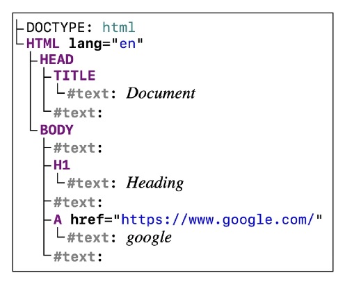

# 10/23 강의
## History of JavaScript
- 웹의 탄생 (1990)
    - 팀 버너스리 경이 WWW, 하이퍼텍스트 시스템 고안
    - URL, HTTP 최초 설계 및 구현
    - 초기의 웹은 정적인 텍스트 페이지만 지원
- 웹 브라우저의 대중화 (1993)
    - Netscape Navigator
- JavaScript의 탄생 (1995)
    - Netscape Navigator에 탑재되어 웹의 동적 기능을 추가
- JavaScript의 파편화 (1996)
    - JavaScript를 독자적으로 변경하고 자체 브라우저에 탑재
- 1차 브라우저 전쟁 (1995-2001)
    - 마이크로소프트는 IE를 윈도우 운영체제에 내장하여 무료 배포
- ECMAScript 출시 (1997)
    - JavaScript 표준 확립 시도
- 2차 브라우저 전쟁 (2004-2017)
    - Chrome의 등장으로 웹 표준의 중요성이 대두
    - 웹 애플리케이션의 발전

### ECMAScript
- Ecma International이 정의하고 있는 표준화된 스크립트 프로그래밍 언어 명세
- JavaScript는 ECMAScript 표준을 구현한 구체적인 프로그래밍 언어
    - ECMAScript는 언어의 핵심을 정의하고
    - JavaScript는 표준에 따라 구현된 언어로 사용됨

## JavaScript and DOM
### DOM
> The Document Object Model
- 웹페이지(Document)를 구조화된 객체로 제공
- 프로그래밍 언어가 페이지 구조에 접근하고 조작할 수 있는 방법을 제공
    - 문서 구조, 스타일, 내용 등을 변경

#### 특징
- DOM에서 모든 요소, 속성, 텍스트는 하나의 객체
- document 객체의 자식

#### DOM Tree
- DOM tree라는 객체 트리로 구조화
    - 객체 간 상속 구조가 존재<br>


## DOM 선택
### 선택 메서드
- document.`querySelector(CSS selector)`
    - 요소 한 개 선택
    - 제공한 CSS selector를 만족하는 첫 번째 element 객체를 반환(없다면 null)
```javascript
const Element = document.querySelector('element')
const Element = document.querySelector('.class')
const Element = document.querySelector('#id')
```
- document.`querySelectorAll(CSS selector)`
    - 요소 여러 개 선택
    - 제공한 CSS selector를 만족하는 NodeList를 반환
```javascript
doc3ument.querySelectorAll('element')
document.querySelectorAll('.class')
document.querySelectorAll('#id')
```

## DOM 조작
### 속성(attribute) 조작
#### 클래스 속성 조작 ('classList' property)
- 요소의 클래스 목록을 DOMTokenList 형태로 반환
```javascript
// 지정한 클래스 값을 추가
Element.classList.add('class')

// 지정한 클래스 값을 제거
Element.classList.remove('class')

// 클래스가 존재한다면 제거하고 false 반환
// 존재하지 않으면 클래스를 추가하고 true 반환
Element.classList.toggle('class')
```

#### 일반 속성 조작
```javascript
// 해당 요소에 지정된 값을 반환 (조회)
Element.getAttribute('attr')

// 지정된 요소의 속성 값을 설정 (속성이 이미 있으면 기존 값을 갱신)
Element.setAttribute('attr', 'value')

// 요소에서 지정된 이름을 가진 속성 제거
Element.removeAttribute('attr')
```

### HTML 콘텐츠 조작 ('textContent' property)
```javascript
// 요소의 텍스트 콘텐츠를 표현
Element.textContent = '내용 수정'
```

### DOM 요소 조작
```javascript
// 작성한 tagName의 HTML요소를 생성하여 반환
document.createElement('tagName')

// 한 Node를 특정 부모 Node의 자식 NodeList 중 마지막 자식으로 삽입
// 추가된 Node 객체를 반환
Node.appendChild('element')

// DOM에서 자식 Node를 제거
// 제거된 Node를 반환
Node.removeChild('element')
```
- 실습
```html
<body>
    <div></div>
</body>
```
```javascript
// 생성
const h1 = document.creatElement('h1')
h1.textContent = 'title'

// 추가
const div = document.querySelector('div')
div.appendChild('h1')
```
```html
<body>
    <div>
        <h1>title</h1>
    </div>
</body>
```
```javascript
// 삭제
div.removeChild('h1')
```
```html
<body>
    <div></div>
</body>
```

### style 조작 ('style' property)
- 해당 요소의 모든 style 속성 목록을 포함하는 속성
- 인라인 스타일로 적용
- 일반적으로는 css로 작성하고 클래스를 추가함
```html
<body>
  <p>Lorem, ipsum dolor.</p>
</body>
```
```javascript
const pTag = document.querySelector('p')

pTag.style.color = 'crimson'
pTag.style.fontSize = '3rem'
pTag.style.border = '1px solid black'
```
```html
<body>
  <p style="color: crimson; font-size: 3rem; border: 1px solid black;">
    Lorem, ipsum dolor.
  </p>
</body>
```

## 참고
### Node
- DOM의 기본 구성 단위
- DOM 트리의 각 부분은 Node라는 객체로 표현됨
    - Document Node -> HTML 문서 전체를 나타내는 노드
    - Element Node -> HTML 요소를 나타내는 노드 ex. <p>
    - Text Node -> HTML 텍스트, Element Node 내의 텍스트 컨텐츠를 나타냄
    - Attribute Node ->HTML 요소의 속성을 나타내는 노드

### NodeList
- DOM 메서드를 사용해 선택한 Node의 목록
- 배열과 유사한 구조를 가짐
- Index로만 각 항목에 접근 가능
- 다양한 배열 메서드 사용 가능
- querySelectorAll()에 의해 반환되는 NodeList는 DOM의 변경사항을 `실시간으로 반영하지 않음`

### Element
- Node의 하위 유형
- Element는 DOM 트리에서 HTML 요소를 나타내는 특별한 유형의 Node
- \<p>, \<div>, \<span>, \<body> 등의 HTML 태그들이 Element Node를 생성
- Node의 속성과 메서드를 모두 가지고 있으며,
- 추가적으로 요소 특화된 기능을 가지고 있음 (className, innerHTML, id 등)
- 모든 Element는 Node이지만, 모든 Node가 Element인 것은 아님

### Parsing
> 구문 분석, 해석
- 브라우저가 문자열을 해석하여 DOM Tree로 만드는 과정