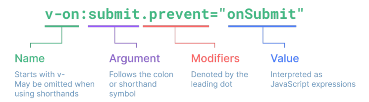

# 11/2 강의
## Template Syntax
- DOM을 기본 구성 요소 인스턴스 데이터에 선언적으로 바인딩할 수 있는 HTML기반 템플릿 구문
### 개요
1. Text Interpolation
    - 데이터 바인딩의 가장 기본적인 형태
```html
<p>Message: {{ msg }}</p>
```
2. Raw HTML
    - 콧수염구문은 데이터를 일반 텍스트로 해석하기 때문에<br> 실제 HTML을 출력하려면 v-html을 사용해야함
3. Attribute Bindings
    - 콧수염 구문은 HTML 속성 내에서 사용할 수 없기 때문에 v-bind를 사용
    - HTML의 id 속성 값을 vue의 dynamicID 속성과 동기화 되되록 함
    - 바인딩 값이 null이나 undefind인 경우 렌더링 요소에서 제외
4. JavaScript Expressions
    - Vue는 모든 데이터 바인딩 내에서 JavaScript 표현식의 모든 기능을 지원
    - Vue 템플릿에서 JavaScript 표현식을 사용할 수 있는 위치
        1. 콧수염 구문 내부
        2. 모든 directive의 속성 값 (v-로 시작하는 특수 속성)
- Expression 주의 사항
    - 각 바인딩에는 하나의 단일 표현식만 포함될 수 있음
        - 표현식은 값으로 평가할 수 있는 코드 조각 (return 뒤에 사용가능한 코드)
    
### Directive
- 'v-' 접두사가 있는 특수 속성

#### Directive 특징
- Directive의 속성 값은 단일 JavaScript 표현식이어야함
- 표현식 값이 변경될 때 DOM에 반응적으로 업데이트를 적용

#### Directive 전체 구문


#### Directive - Arguments
- 일부 directive는 directive뒤에 콜론(:)으로 표시되는 인자를 사용할 수 있음

#### Directive - Modifier
- .(dot)로 표시되는 특수 접미사
- 체이닝 가능

#### Built-in Directives

## Dynamically data binding
- v-bind
    - 하나 이상의 속성 또는 컴포넌트 데이터를 표현식에서 동적 바인딩
    - 사용처
        1. Attribute Bindings
        2. Class and Style Bindings
### Attribute Bindings
- HTML의 속성 값을 Vue의 상태 속성 값과 동기화 되도록 함
- v-bind shorthand
    - ':'(colon)
- Dynamic Attribute name (동적 인자 이름)
    - 대괄호로 감싸서 directive argument에 JavaScript 표현식을 사용
        - `대괄호 안에 작성하는 이름은 반드시 소문자로만 구성`
    - JavaScript 표현식에 따라 동적으로 평가된 최종 argument 값으로 사용됨

### Class and Style Bindings
#### Binding HTML Classes - Binding to Object
#### Binding HTML Classes - Binding to Arrays

## Event Handling
```vue
v-on:event="handler"
```

## Form Input Bindings