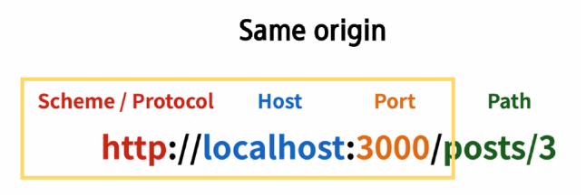

# 11/14 강의
## 메인 페이지 구현
### state with DRF

## CORS Policy
### CORS
#### SOP
> 동일 출처 정책 (Same-origin policy)
- 어떤 출처(Origin)에서 불러온 문서나 스크립트가 다른 출처에서 가져온 리소스와 상호 작용하는 것을 제한하는 보안 방식
- 웹 애플리케이션의 도메인이 다른 도메인의 리소스에 접근하는 것을 제어하여 사용자의 개인 정보와 데이터의 보안을 보호하고, 잠재적인 보안 위협을 방지
- 잠재적으로 해로울 수 있는 문서를 분리함으로써 공격받을 수 있는 경로를 줄임

#### Origin (출처)
- URL의 Protocol, Host, Port를 모두 포함하여 "출처"라고 부름
- `세 영역이 일치하는 경우에만 동일 출처(Same-origin)`로 인정 

#### CORS policy의 등장
- 현대 웹 애플리케이션은 다양한 출처로부터 리소스를 요청한느 경우가 많기 때문에 CORS 정책이 필요하게 되었음
- `CORS`는 웹 서버가 리소스에 대한 서로 다른 출처 간 접근을 허용하도록 선택할 수 있는 기능을 제공

#### CORS
> 교차 출처 리소스 공유 (Cross-Origin Resource Sharing)
- `다른 출처의 자원에 접근할 수 있는 권한을 부여`하도록 브라우저에 알려주는 체제
- 만약 다른 출처의 리소스를 가져오기 위해서는 이를 제공하는 서버가 브라우저에게 다른 출처지만 접근해도 된다는 사실을 알려야함
- "CORS policy (교차 출처 리소스 공유 정책)"

#### CORS policy (교차 출처 리소스 공유 정책)
- `CORS header를 포함한 응답을 반환`해야함

### CORS Header 설정

## Article Create 구현