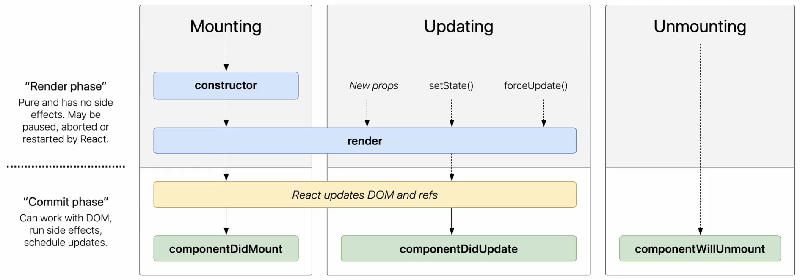

# day3 (1월 10일) 학습

## Components와 Props
> props -> React components -> React element

### Props (property)
- 컴포넌트에 전달할 다양한 정보를 담고있는 자바스크립트 객체
- 특징
    - Read-only : 모든 리액트 컴포넌트는 Props를 직접 바꿀 수 없고, 같은 Props에 대해서는 항상 같은 결과를 보여줄 것
- 사용법
```jsx
function App(props) {
    return (
        <Layout
            width={2560}
            height={1440}
            header={
                <Header title="블로그"/>
            }
            footer={
                <Footer />
            }
        />
    );
}
```

### Component
- Function Component
```jsx
function Welcome(props) {
    return <h1>hello, {props.name}</h1>;
}
```
- Class Component
```jsx
class Welcome extends React.Component {
    render() {
        return <h1>hello, {props.name}</h1>;
    }
}
```
- Component의 이름
    - 향상 대문자로 시작해야 함
```jsx
// HTML div 태그로 인식
const element = <div />;

// Welcome이라는 리액트 Component로 인식
const element = <Welcome name="코코" />;
```
- Component 렌더링
```jsx
function Welcome(props) {
    return <h1>hello, {props.name}</h1>;
}

const element = <Welcome name="코코" />;

ReactDOM.render(
    element,
    document.getElementById('root')
)
// const root = ReactDOM.createRoot(document.getElementById('root'));
// root.render(element);
```
- Component 합성
```jsx
function Welcome(props) {
    return <h1>hello, {props.name}</h1>;
}

function App(props) {
    return (
        <div>
            <Welcome name="Mike" />
            <Welcome name="Jane" />
        </div>
    )
}

ReactDOM.render(
    <App />,
    document.getElementById('root')
)
```
- Component 추출
```jsx
function Comment(props) {
  return (
    <div className="comment">
      <div className="user-info">
        
        <div className="user-info-name">
          {props.author.name}
        </div>
      </div>

      <div className="comment-text">
        {props.text}
      </div>

      <div className="comment-date">
        {formatDate(props.date)}
      </div>
    </div>
  );
}
```
```jsx
// 추출
function Avatar(props) {
    return (
        
    );
}
// 적용
function Comment(props) {
  return (
    <div className="comment">
      <div className="user-info">
        {/* 반영된 코드 */}
        <Avatar user={props.author} />
        <div className="user-info-name">
          {props.author.name}
        </div>
      </div>

      <div className="comment-text">
        {props.text}
      </div>

      <div className="comment-date">
        {formatDate(props.date)}
      </div>
    </div>
  );
}
```
```jsx
// 추출
function UserInfo(props) {
    return (
        <div className="user-info">
            <Avatar user={props.user} />
            <div className="user-info-name">
                {props.user.name}
            </div>
      </div>
    );
}
// 적용
function Comment(props) {
  return (
    <div className="comment">
      {/* 반영된 코드 */}
      <UserInfo user={props.author} />

      <div className="comment-text">
        {props.text}
      </div>

      <div className="comment-date">
        {formatDate(props.date)}
      </div>
    </div>
  );
}
```

### [실습](./frontend/src/chap_05/)

## `State`와 Lifecycle
### State
- 리액트 Component의 변경 가능한 데이터
  - 개발자가 결정한다
  - 렌더링이나 데이터 흐름에 사용되는 값만 state에 포함시켜야 한다
  - JavaScript의 객체이다
```jsx
class LikeButton extends React.Component {
  constructor(props) {
    super(props);

    this.state = {
      liked: false
    };
  }
}
```
```jsx
// 직접 수정 X
// this.state = {
//   name: 'Jane'
// };
// setState 함수를 통해 수정
this.setState({
  name: 'Jane'
});
```

### Lifecycle


### [실습](./frontend/src/chap_06/)