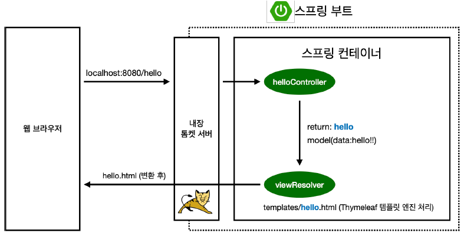

# Spring 시작하기

## 프로젝트 생성
- 준비
    - Java 17 이상
    - 스프링 부트 3.0 이상
- 스프링 부트 스타터 사이트에서 스프링 프로젝트 생성
    - https://start.spring.io/
    - 프로젝트 선택
        - Project: **Gradle - Groovy** Project
        - Spring Boot: **3.x.x**
        - Language: Java
        - Packaging: Jar
        - Java: 17 또는 21
    - Project Metadata
        - groupId: hello
        - artifactId: hello-spring
    - Dependencies: Spring Web, Thymeleaf
- GENERATE
- 압축 해제
- 인텔리제이 - build.gradle - Open as Project
- src/main/java/hello/hellospring/HelloSpringApplication.java 실행 = 웹 실행

## View 환경설정
### Welcome page
- resources - static - index.html

### controller
```java
// hello.jellospring - controller 패키지 생성 - HelloController 클래스 생성
package hello.hellospring.controller;

import org.springframework.stereotype.Controller;
import org.springframework.ui.Model;
import org.springframework.web.bind.annotation.GetMapping;

@Controller     // @Controller 선언
public class HelloController {

    @GetMapping("hello")
    public String hello(Model model) {
        model.addAttribute("data", "hello!");       // data의 value = hello!
        // 리턴 값으로 문자(ViewName)를 반환하면 viewResolver가 화면을 찾아서 처리
        // resources: templates/{ViewName}.html
        return "hello";     
    }
}
```
```html
<!-- resources/templates/hello.html -->
<!DOCTYPE HTML>
<!-- thymeleaf 선언 -->
<html xmlns:th="http://www.thymeleaf.org">
<head>
    <title>Hello</title>
    <meta http-equiv="Content-Type" content="text/html; charset=UTF-8" />
</head>
<body>
<p th:text="'안녕하세요. ' + ${data}" >안녕하세요. 손님</p>
</body>
</html>
```
### 동작 환경 그림


## 빌드하고 실행하기
### 빌드
```bash
./gradlew build
```
### 실행
```bash
cd build/libs/
java -jar hello-spring-0.0.1-SNAPSHOT.jar
```
### 빌드 파일 삭제 후 필드
```bash
./gradlew clean build
```